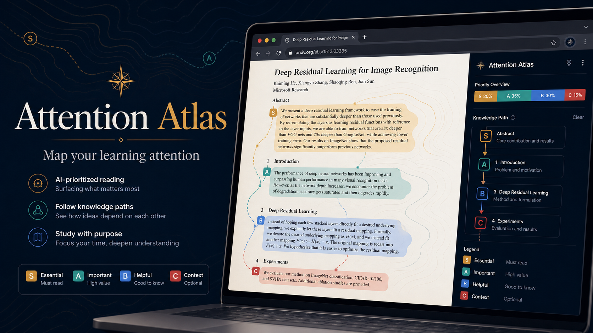

# Attention Atlas

[中文说明](README.zh-CN.md)

Attention Atlas is a browser extension for academic and technical reading. It does not try to summarize everything on a page. Its core job is learning attention allocation: mapping which knowledge blocks deserve deep study, which can be skimmed, which can wait, and which are safe to skip for your current goal.

The extension is designed for high-intensity learners working through courses, papers, textbooks, PDFs, documentation, proofs, and implementation-heavy material. It marks page-level knowledge blocks, ranks them with S/A/B/C attention levels, and explains the minimum mastery needed to keep moving.

## Why this exists

Long learning materials are full of traps: interesting details that do not matter yet, proofs that only matter after the main idea is stable, examples that are essential for intuition, and definitions that block every later chapter. Attention Atlas helps decide where attention is worth spending now.

## Attention levels

- `S`: must understand now. In learning mode, S-level blocks require an active recall answer before they can be marked as mastered.
- `A`: important for the current goal and worth careful reading.
- `B`: useful context, but not the main bottleneck.
- `C`: low priority now. These blocks can be collapsed automatically.

Each analyzed block can include its semantic role, required depth, skip recommendation, future dependency, minimum mastery standard, and continue-or-stop guidance.

## Modes

- Learning mode: for courses, textbooks, papers, PDFs, docs, and systematic study. It keeps a per-page checklist and uses active recall for S-level blocks.
- Surfing mode: for news, blogs, public articles, and background browsing. It highlights what deserves attention without asking mastery questions.

## Install locally

1. Open `chrome://extensions` or `edge://extensions`.
2. Enable developer mode.
3. Choose `Load unpacked`.
4. Select this folder.

## Notes

This version always uses the configured LLM for attention allocation. If the model request fails or returns invalid JSON, the extension shows an error instead of falling back to local heuristics.
