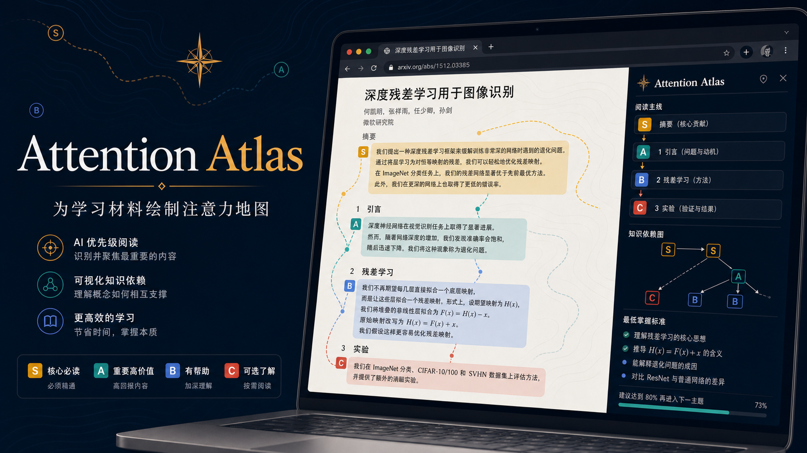
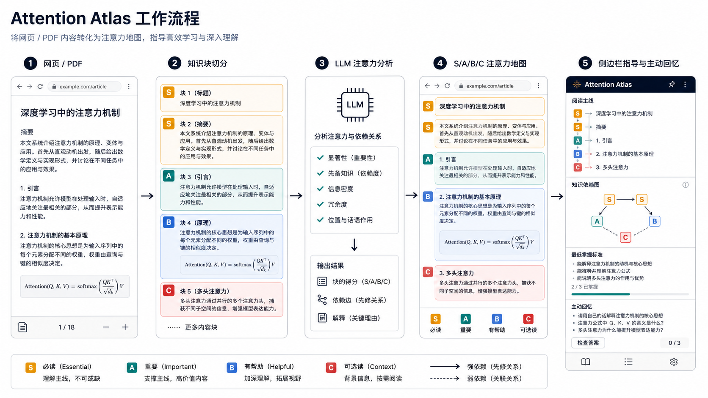

# Attention Atlas

[English README](README.md)

Attention Atlas 是一个面向课程、论文、教材、PDF 和技术文档阅读的浏览器扩展。它不是总结器，核心能力是学习注意力分配：判断一页内容里哪些知识块值得深度理解，哪些可以快速浏览，哪些可以暂时延后，哪些在当前目标下可以跳过。

它面向高强度学习者：本科生、硕士生、博士生，以及需要长期处理复杂技术材料的人。扩展会把页面切成知识块，用 `S/A/B/C` 标注注意力等级，并解释继续学习前最低需要掌握到什么程度。

## 为什么需要它

长学习材料里常见的问题不是“信息不够”，而是“注意力放错位置”。有些细节很有趣但现在不重要；有些证明要等主线概念稳定后再看；有些例子是建立直觉的关键；有些定义如果没吃透，后面每一章都会卡住。

Attention Atlas 的目标是帮你判断：现在最值得投入注意力的地方在哪里。

## 注意力等级

- `S`：现在必须理解。学习模式下，S 级知识块需要写出主动回忆答案后才能标记为掌握。
- `A`：对当前目标很重要，值得认真阅读。
- `B`：有用的背景或补充，但不是当前主要瓶颈。
- `C`：当前低优先级，可以自动折叠。

每个知识块可以包含语义角色、需要理解到的深度、是否可跳过、未来依赖、最低掌握标准，以及是否可以继续往后学的判断。

## 模式

- 学习模式：用于课程、论文、教材、PDF、技术文档和系统学习。它会保留页面级清单，并对 S 级知识块强制主动回忆。
- 冲浪模式：用于新闻、博客、公众号文章和背景阅读。它只标出值得注意的内容，不要求回答掌握问题。

## 本地安装

1. 打开 `chrome://extensions` 或 `edge://extensions`。
2. 开启开发者模式。
3. 选择 `Load unpacked` / `加载已解压的扩展程序`。
4. 选择本目录。

## 说明

当前版本始终使用配置好的 LLM 做注意力分配。如果模型请求失败，或返回了无效 JSON，扩展会显示错误，不会回退到本地启发式规则。
